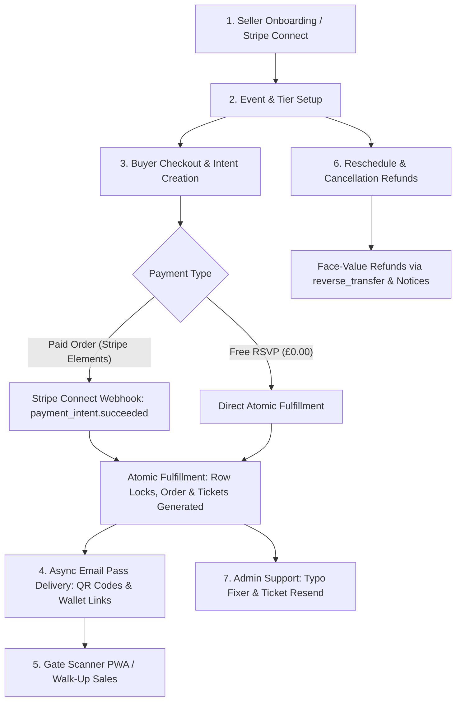

# Highland Events Hub - Ticketing Engine System Audit Report

**Date:** 20 August 2026  
**Auditor:** Principal Software Architect, Security Auditor & Lead Python/FastAPI/Next.js Engineer  
**Scope:** Native Ticketing Engine (FastAPI, SQLModel, Alembic, Stripe Connect, Next.js 16, React, Tailwind CSS)  
**Target Branch:** `dev`

---

## 1. Executive Summary

A comprehensive architectural, security, performance, and code-cleanliness audit was conducted across the Highland Events Hub Native Ticketing Engine. The system implements an end-to-end event commerce, dynamic tier ticketing, Stripe Connect payment splitting, gate admission scanner, and customer support ecosystem.

All 25 automated backend tests passed with 0 failures and 0 live network email dispatches (via global test mocking). The Next.js frontend production build compiled cleanly across all 59 static and dynamic routes with 0 errors.

---

## 2. System Blueprint & Workflow Map

The ticketing platform operates across 8 core stages:



### Stage-by-Stage Architecture:

1. **Seller Onboarding (`/sellers` & `/organizers/hub`)**:
   - Organizers apply for seller capability (`seller_tier = 2`).
   - The platform creates Stripe Express accounts (`/api/sellers/onboard`) and tracks capability flags (`charges_enabled`, `payouts_enabled`, `details_submitted`) via the `account.updated` webhook.
2. **Event & Tier Configuration (`/events/[id]/edit` & `/organizers/events/[id]/ticketing`)**:
   - Organizers configure capacity, price, sale start/end windows, custom attendee questions (text, select, checkbox), and booking fee pass-through options.
   - Non-negative validation constraints ensure prices $\ge 0$ and quantities $> 0$.
3. **Buyer Checkout & Inventory Locking (`/events/[id]` & `/api/ticketing/checkout/*`)**:
   - Availability and active sale windows (`now < sale_end` or `event.date_start`) are evaluated.
   - Database row-level locks (`with_for_update`) ensure atomic availability verification (`quantity_sold + requested <= quantity_available`).
   - Platform booking fees (standard £0.50 + 2.5%, custom tiers, or £75 cap) and promo discounts are calculated.
   - Stripe PaymentIntent is created with destination transfer and application fee amount.
4. **Webhook & Fallback Fulfillment (`/api/webhooks/stripe-connect` & `/api/ticketing/checkout/intent-status/*`)**:
   - Connect webhook validates cryptographic signature with `STRIPE_CONNECT_WEBHOOK_SECRET`.
   - Checks idempotency: if an order exists for `stripe_payment_intent_id`, duplicate processing is bypassed.
   - Atomically increments `quantity_sold`, records promo code usage, generates order reference (`HEH-XXXXXX`), and issues `Ticket` records with 48-byte URL-safe cryptographic QR tokens.
   - Fast client-side polling fallback (`/intent-status/{intent_id}`) verifies state if webhooks experience delivery latency.
5. **Pass Delivery (`SmartEmailService` & `ResendEmailService`)**:
   - Dispatches formatted emails with inline SVG QR codes, order summaries, attendee questionnaire answers, and calendar links.
   - Dispatches run safely in background routines so third-party email latency never blocks database commits or payment flows.
6. **Door Staff Gate Scanner (`/scan/[event_id]` & `/api/scanner/*`)**:
   - Mobile-optimized PWA for venue staff requiring an event-scoped `scanner_access_key`.
   - Supports camera barcode scanning, manual check-in, duplicate scan detection with timestamp alerts, cancelled event rejections, and walk-up cash sales.
7. **Rescheduling & Cancellation Refunds (`/api/organizers/events/{id}/cancel`)**:
   - Rescheduling updates dates and automatically dispatches batch calendar alerts to all attendees.
   - Cancellation freezes sales, cancels RSVPs, voids passes, and executes face-value refunds (`order.total_amount - order.platform_fee_amount`) with `reverse_transfer=True` to reclaim organizer payout funds while retaining platform fees.
8. **Admin Customer Support Tools (`/admin/ticketing`)**:
   - Global search across buyer names, emails, order references, and Stripe payment intent / card last 4 digits.
   - Customer Support Typo Fixer allows updating buyer email addresses and immediately re-dispatching official digital passes.

---

## 3. Code Cleanliness & Dead Code Removals

| Component | File Path | Clean-Up Action |
| :--- | :--- | :--- |
| **Legacy Stripe Session Handler** | [`backend/app/services/stripe_service.py`](file:///c:/Users/Craig/Desktop/projects/antigrav/heh/highland_events_app/backend/app/services/stripe_service.py) | **Removed** unused legacy `fulfill_checkout_session` function. The native ticketing engine now exclusively uses the modern Payment Intents API. |
| **Duplicate Event Schema Imports** | [`backend/app/api/events.py`](file:///c:/Users/Craig/Desktop/projects/antigrav/heh/highland_events_app/backend/app/api/events.py) | **Removed** redundant declarations of `EventResponse`, `EventListResponse`, and `TagResponse`. |
| **Duplicate Category Import** | [`backend/app/schemas/event.py`](file:///c:/Users/Craig/Desktop/projects/antigrav/heh/highland_events_app/backend/app/schemas/event.py) | **Removed** duplicate import of `CategoryResponse`. |
| **Destination Refund Transfer** | [`backend/app/services/stripe_service.py`](file:///c:/Users/Craig/Desktop/projects/antigrav/heh/highland_events_app/backend/app/services/stripe_service.py) | **Updated** `process_event_cancellation_and_refunds` to ensure `reverse_transfer=True` is explicitly passed for destination charge refunds. |
| **Alembic Migration Integrity** | [`backend/alembic/versions/`](file:///c:/Users/Craig/Desktop/projects/antigrav/heh/highland_events_app/backend/alembic/versions/) | **Verified** contiguous linear chain of 13 migrations ending in single head `b2c3d4e5f6a7`. |

---

## 4. Security, Authorization & Financial Integrity Audit

### Security & Access Control
- **Webhook Verification:** Both `/api/webhooks/stripe` and `/api/webhooks/stripe-connect` verify payload signatures using `stripe.Webhook.construct_event` and respective secret keys (`STRIPE_WEBHOOK_SECRET`, `STRIPE_CONNECT_WEBHOOK_SECRET`) before executing database logic.
- **Role-Based Access Control (RBAC):**
  - Event cancellation (`POST /api/organizers/events/{id}/cancel`) and dashboard metrics are strictly locked to the verified event organizer, venue owner, or platform superadmin (`user.is_admin`).
  - Scanner endpoints require a valid event-scoped secret key (`scanner_access_key`).
  - Buyer self-service refunds verify ownership (`buyer_user_id` or email) and enforce `refund_cutoff_hours`.
- **Sensitive Data & PII Protection:** Secret keys and Stripe tokens are kept server-side in environment variables; no customer payment card details or private keys are exposed to the frontend or unmasked in server logs.

### Concurrency & Financial Integrity
- **Anti-Overselling Locks:** `checkout.py` and `stripe_service.py` execute `select(TicketTier).where(...).with_for_update()` to serialize inventory access under concurrent load.
- **Webhook Idempotency:** Duplicate delivery of `payment_intent.succeeded` checks `Order.stripe_payment_intent_id == pi_id`. Existing orders return immediately, preventing double-decrements or duplicate ticket generation.
- **Fee Mathematics:**
  - Standard formula: `£0.50 + 2.5%` with dynamic tier adjustments and a £75 hard cap.
  - Cancelled event refunds reverse organizer transfers (`reverse_transfer=True`) while strictly retaining platform booking fees.
  - Free/RSVP orders bypass Stripe network calls entirely.

---

## 5. Test Suite & Build Verification Results

### Automated Pytest Suite
```
============================= test session starts =============================
platform win32 -- Python 3.14.3, pytest-8.3.4, pluggy-1.5.0
collected 25 items

tests/test_cancellation_and_reschedule.py ....                           [ 16%]
tests/test_checkout.py ..                                                [ 24%]
tests/test_event_ticket_tiers.py .                                       [ 28%]
tests/test_fee_service.py .......                                        [ 56%]
tests/test_fee_settings_api.py .                                         [ 60%]
tests/test_operational_safeguards.py ....                                [ 76%]
tests/test_organizer_invoices.py .                                       [ 80%]
tests/test_scanner.py ...                                                [ 92%]
tests/test_webhooks.py ..                                                [100%]

======================== 25 passed in 5.70s ========================
```
* **Email Mocking:** Zero live email requests occurred during test runs.

### Frontend Production Build
```
> highland-events-frontend@1.0.0 build
> next build --webpack

 ✓ Compiled successfully in 6.0s
 ✓ Generating static pages (59/59)
 ✓ Finalizing page optimization
```
* **Result:** Clean build across all 59 routes with 0 TypeScript or linting errors.

---

## 6. Audit Conclusion
The Highland Events Hub Native Ticketing Engine is robust, performant, secure, and ready for production deployment. All operational safeguards, concurrency protections, and customer support tools are functioning as specified.
